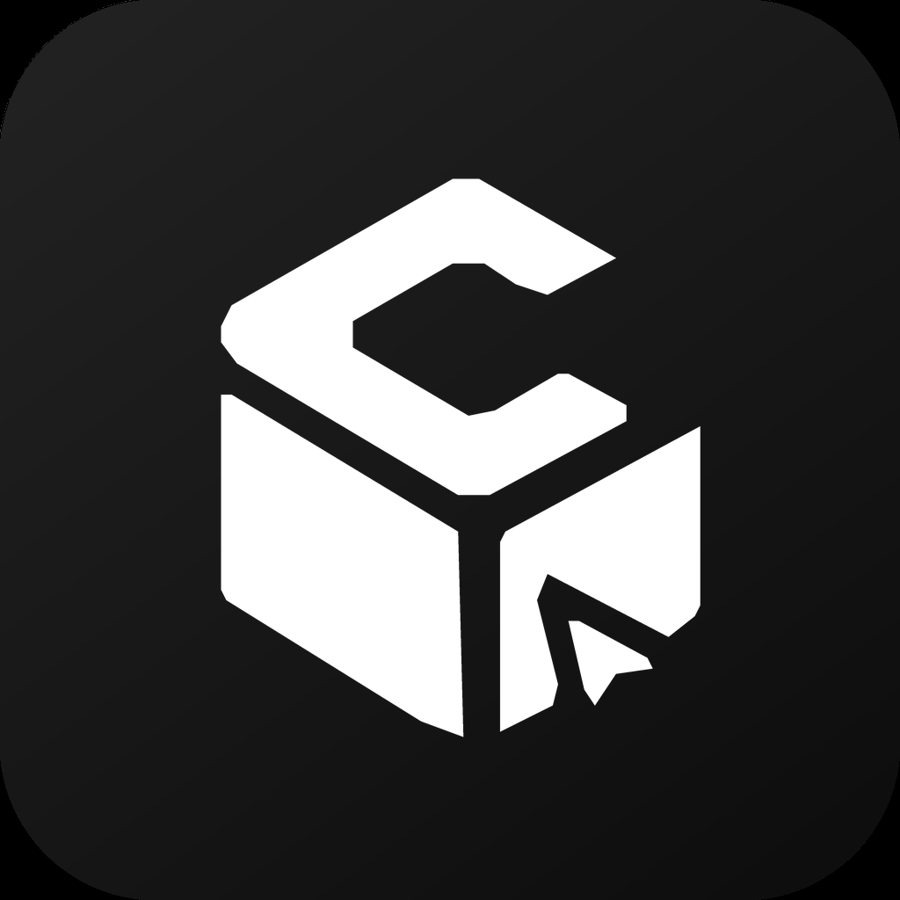

<div align="center">



# ClerkBox

**A local-first AI desktop workbench: multi-provider chat, tool calling, sub-agents, skills, and VIBE immersive mode.**

[](https://github.com/XMZF-vAI/clerkbox/releases)
[](LICENSE)
[](https://www.electronjs.org/)
[](https://react.dev/)
[](https://www.typescriptlang.org/)
[](#download-and-install)

</div>

**English** | [简体中文](README.md)

---

> ClerkBox is a local-first AI desktop workbench. It brings multi-provider chat, a ReAct tool loop, sub-agent orchestration, reusable skills, long-term memory, and VIBE immersive mode together in a native Windows app, so you can search, write, code, and automate from a single panel.

> ClerkBox is built by [XMZF Studio](https://github.com/XMZF-vAI) — the author is a 7th-grade student. Bug reports and ideas are very welcome via Issues.

---

## Table of Contents

- [Highlights](#highlights)
- [Core Capabilities](#core-capabilities)
- [Download and Install](#download-and-install)
- [Build from Source](#build-from-source)
- [Quick Start](#quick-start)
- [Configuration](#configuration)
- [Tool System](#tool-system)
- [Sub-Agents](#sub-agents)
- [Skills System](#skills-system)
- [Long-Term Memory](#long-term-memory)
- [WebUI Remote Access](#webui-remote-access)
- [AGENTS.md Project Instructions](#agentsmd-project-instructions)
- [VIBE Immersive Mode](#vibe-immersive-mode)
- [Theme & Appearance](#theme--appearance)
- [Project Structure](#project-structure)
- [Tech Stack](#tech-stack)
- [Roadmap](#roadmap)
- [Contributing](#contributing)
- [License](#license)
- [Acknowledgements](#acknowledgements)

---

## Highlights

| Capability | Description |
| --- | --- |
| **Multi-provider presets** | 22 built-in providers (Lunora / OpenAI / Anthropic / Gemini / DeepSeek / Qwen / Zhipu GLM / Ollama, etc.). Each provider pulls its model list from `/models` automatically. Custom endpoints with OpenAI or Anthropic protocol supported. |
| **ReAct tool loop** | Reason → call tools → observe → reason again, up to 999 iterations, abortable at any time. |
| **Sub-agent orchestration** | Built-in read-only Scout and full-tool General assistant, plus custom sub-agents via frontmatter with isolated contexts. |
| **Skills marketplace** | One-click install of prompt templates from the CocoLoop community, auto-injected into the system prompt. |
| **Long-term memory** | `user` / `feedback` / `project` / `reference` memory entries persist across sessions. |
| **Thinking & per-model tuning** | Per-model thinking toggle / tiers (low / medium / high), temperature and token limits; model picker groups models by thinking capability. |
| **AGENTS.md project instructions** | Auto-reads `AGENTS.md` from the working directory and injects it into the system prompt; falls back to `CLAUDE.md`. |
| **VIBE immersive mode** | Fullscreen background, liquid-glass UI, and a floating music player. |
| **MD3 dynamic theming** | Material Design 3 color engine with light / dark / system modes and custom seed color. |
| **WebUI remote access** | Built-in web server exposes the full UI to any browser, with real-time data sync between desktop and web. |
| **Local-first** | All sessions, memory, skills, and config live on disk — no cloud dependency. |

---

## Core Capabilities

### 1. Multi-Provider Chat

`src/lib/provider-catalog.ts` ships **22 provider presets** sorted into 6 groups: official / international / china / aggregator / local / custom.

- Presets only fill in the baseUrl and protocol (OpenAI or Anthropic) when adding a provider
- Model IDs are pulled live from each provider's `/models` endpoint, so the catalog never goes stale
- Switch the current model at any time during a session; the main agent and sub-agents can use different models
- Thinking-capable models are auto-detected by keyword match; unmatched models can be toggled manually in per-model settings
- **Per-model advanced settings**: configure thinking toggle / tiers, temperature, context budget and output limits independently for each model

### 2. ReAct Tool Loop

The main agent uses the standard ReAct (Reasoning + Acting) pattern:

```
User input
   ↓
LLM reasoning (thinking)
   ↓
Tool call (read_file / search_content / execute_command / ...)
   ↓
Tool results flow back
   ↓
Keep reasoning or return the final answer
```

- Streaming output with real-time thinking display
- Hit **Stop** at any time to abort, including force-kill of child processes
- Dangerous commands (`rm -rf`, `format`, `Stop-Computer`, etc.) are auto-blocked and require confirmation
- A `.clerkbox-bak` backup is created before any file write

### 3. Sub-Agent Orchestration

Complex tasks can spawn sub-agents running in isolated contexts:

| Agent | Type | Capabilities |
| --- | --- | --- |
| `explore` Scout | Read-only | `search_files`, `search_content`, `read_file`, `web_search`, `web_fetch` |
| `general` Assistant | All tools | Inherits all parent-agent tools, runs independently over multiple turns |
| Custom agent | Custom | Configure tools / model / maxTurns / systemPrompt via frontmatter |

Sub-agents only return a **final summary** to the parent agent, so the main context stays clean.

### 4. Skills System

Skills are reusable prompt templates (`SKILL.md` + frontmatter) stored in `.clerkbox/skills/`.

- **Marketplace**: one-click install from the [CocoLoop Hub](https://hub.cocoloop.cn)
- **Custom**: write your own skills in `.clerkbox/skills/<slug>/SKILL.md`
- **Auto-injection**: active skills are injected into the system prompt at session start
- **Hot toggle**: enable / disable skills anytime during a session

### 5. Long-Term Memory

Memory entries are organized by type under `.clerkbox/memory/`:

| Type | Purpose |
| --- | --- |
| `user` | User preferences, background, tech stack (cross-project) |
| `feedback` | User feedback and corrections |
| `project` | Project-level rules, conventions, decisions |
| `reference` | Reference materials, links, notes |

The agent writes entries via the `save_memory` tool and retrieves them through a frontmatter index.

### 6. AGENTS.md Project Instructions

ClerkBox follows the cross-tool standard: at the start of every session, it auto-reads `AGENTS.md` from the working-directory root and injects it into the system prompt, so the AI immediately knows the project's stack, build commands, and coding conventions.

- **Cross-tool standard**: `AGENTS.md` is the common convention promoted by [agentskills.io](https://agentskills.io) and [agents.md](https://agents.md); natively supported by OpenAI Codex, OpenCode, Qwen Coder, etc.
- **CLAUDE.md fallback**: under **Settings → General**, enable "CLAUDE.md compatibility" to fall back to `CLAUDE.md` when `AGENTS.md` is absent
- **Fully optional**: turn injection off if you don't need it

### 7. VIBE Immersive Mode

One click to enter a focused conversation environment. See [VIBE Immersive Mode](#vibe-immersive-mode) for details.

---

## Download and Install

Download the latest `ClerkBox Setup x.x.x.exe` from [Releases](https://github.com/XMZF-vAI/clerkbox/releases) and double-click to install.

- Installer size: ~120 MB
- Supports Windows 10 / 11 (x64)
- NSIS installer with optional install path and desktop shortcut

---

## Build from Source

### Requirements

- **Node.js** ≥ 18 (20 LTS recommended)
- **npm** ≥ 9 or **pnpm** ≥ 8
- **Windows 10/11** (currently builds for Windows only)

### Steps

```bash
# 1. Clone the repo
git clone https://github.com/XMZF-vAI/clerkbox.git
cd clerkbox

# 2. Install dependencies
npm install

# 3. Start dev mode (Vite + Electron together)
npm run dev

# 4. Build production (compile Electron main + Vite bundle + electron-builder NSIS installer)
npm run build
```

Build artifacts land in `release-out/`:

- `ClerkBox Setup x.x.x.exe` — NSIS installer
- `ClerkBox Setup x.x.x.exe.blockmap` — incremental-update blockmap
- `latest.yml` — electron-updater metadata
- `win-unpacked/` — unpacked directory

### npm scripts

| Command | Purpose |
| --- | --- |
| `npm run dev` | Start dev server (port 5175) and Electron |
| `npm run dev:alt` | Same, using port 5176 (when 5175 is busy) |
| `npm run build:electron` | Compile Electron main-process TypeScript only |
| `npm run build` | Full production build (generates installer) |
| `npm run preview` | Preview the built frontend with Vite |

---

## Quick Start

1. **First launch**: complete the welcome tour, choose a theme and color scheme
2. **Add a provider**: go to **Settings → API Config → Add Provider**, pick one of the 22 presets, and enter your API key. Model IDs auto-populate from the provider's `/models` endpoint.
3. **Pick a working directory**: click the button at the bottom of the sidebar to choose a project folder
4. **(Optional) Add AGENTS.md**: drop an `AGENTS.md` at the working-directory root to describe your project stack and conventions
5. **Start chatting**: type your request, for example:
   - "Refactor the parseDate function in src/utils.ts"
   - "Analyze this project's dependency structure"
   - "Search for all TODO comments and list them"
6. **Spawn sub-agents**: the agent decides automatically whether a sub-agent is needed for complex subtasks
7. **Enter VIBE mode**: click the VIBE button in the title bar

---

## Configuration

All configuration is managed through the **Settings panel** and persisted locally.

### App Configuration

- **Theme**: `light` / `dark` / `system`
- **Color scheme**: MD3 palette preset or custom seed color
- **VIBE mode**: background image, music source
- **Working directory**: project directory bound to the current session
- **Data directory**: defaults to `%APPDATA%/ClerkBox`
- **Language**: Chinese (default) / English, switchable at runtime
- **AGENTS.md injection**: auto-read `AGENTS.md` from the working-directory root into the system prompt; optional `CLAUDE.md` fallback
- **Token usage**: total API calls, input/output tokens, cache writes/hits and hit rate (Settings → General)
- **Per-model advanced settings**: configure thinking toggle / tiers, Temperature, context budget and output Max Tokens independently for each model
- **WebUI remote access**: see [WebUI Remote Access](#webui-remote-access)

### Data Directory Layout

```
.clerkbox/
├── memory/              # long-term memory
│   ├── user/
│   ├── feedback/
│   ├── project/
│   └── reference/
├── skills/              # installed skills
│   └── <slug>/
│       └── SKILL.md
├── agents/              # custom agents
│   └── <name>.md
└── *.clerkbox-bak       # backups before file modification
```

---

## Tool System

The agent can call the following tools to get work done:

### File Operations

| Tool | Description |
| --- | --- |
| `read_file` | Read a file at the given path, returning full text with line numbers |
| `write_file` | Write a file (auto-backs up the original to `.clerkbox-bak`) |
| `search_replace` | Precise string-match local edit (no line numbers needed) |
| `list_dir` | List directory contents |
| `search_files` | Search files by glob pattern |
| `search_content` | Search file contents by regex |

### Web Tools

| Tool | Description |
| --- | --- |
| `web_search` | Web search (parses cn.bing.com HTML, no API key needed) |
| `web_fetch` | Fetch a webpage, auto-falling back to a hidden BrowserWindow to render SPAs |

### System Tools

| Tool | Description |
| --- | --- |
| `execute_command` | Execute shell commands (dangerous commands auto-blocked) |
| `spawn_agent` | Spawn a sub-agent for a subtask |
| `save_memory` | Write a long-term memory entry |

### Security Mechanisms

- **Dangerous command blocking**: `DANGEROUS_PATTERNS` blacklist covers `rm -rf`, `format`, fork bombs, `Stop-Computer`, etc.
- **Write whitelist**: Plan mode only allows writes under `.clerkbox/plan/`
- **Path validation**: all file operations must stay within the current working directory
- **URL scheme validation**: `openExternal` only allows `http://` / `https://`

---

## Sub-Agents

### Built-in Agents

#### Scout (`explore`)

A read-only recon agent, great for broad searches and multi-file reading:

- Only `read_file` / `list_dir` / `search_files` / `search_content` / `web_search` / `web_fetch`
- Default 30-turn limit
- Never creates, modifies, or deletes any files

#### General (`general`)

A general-purpose sub-task executor:

- Inherits all parent-agent tools
- Default 50-turn limit
- Isolated context, returns only a final summary

### Custom Agents

Create a Markdown file in `.clerkbox/agents/`:

```markdown
---
name: translator
description: Chinese-English translation expert
whenToUse: use when high-quality translation is needed
tools: [read_file, write_file, web_search]
disallowedTools: [execute_command]
model: deepseek-chat
maxTurns: 20
color: purple
---

You are a Chinese-English translation expert. Rules:
- Preserve the original tone and style
- Prefer industry-standard terminology for technical documents
- Output a bilingual comparison when done
```

Field reference:

| Field | Required | Description |
| --- | --- | --- |
| `name` | Yes | Agent type identifier (unique) |
| `description` | No | Display name |
| `whenToUse` | No | When to use this agent |
| `tools` | No | Allowed tools; `[*]` means all |
| `disallowedTools` | No | Disallowed tools |
| `model` | No | Model ID |
| `maxTurns` | No | Max iteration turns |
| `color` | No | Accent color (blue/green/purple/...) |

---

## Skills System

### Skill Format

Each skill is a directory containing a `SKILL.md` file:

```markdown
---
name: code-reviewer
description: Code review expert
version: 1.0.0
---

You are a senior code review expert. When reviewing, focus on:
1. Security vulnerabilities
2. Performance issues
3. Readability
4. Error handling

Output format:
- Severity (high/medium/low)
- Problem description
- Fix suggestion
```

### Installing Skills

- **From the marketplace**: click "Skills" in the sidebar → browse recommendations → one-click install (data source: [CocoLoop Hub](https://hub.cocoloop.cn))
- **Manually**: put the skill directory into `.clerkbox/skills/<slug>/`
- **From a URL**: the marketplace accepts a GitHub raw URL to pull a remote SKILL.md

### Enable / Disable

Skills can be selectively enabled at the start of each session; active skills are auto-injected into the system prompt.

---

## Long-Term Memory

The memory system lets the agent keep understanding your projects and preferences across sessions.

### Memory Types

| Type | Directory | Purpose |
| --- | --- | --- |
| `user` | `.clerkbox/memory/user/` | User profile: preferences, background, tech stack, style |
| `feedback` | `.clerkbox/memory/feedback/` | User feedback and corrections |
| `project` | `.clerkbox/memory/project/` | Project-level conventions, architectural decisions, rules |
| `reference` | `.clerkbox/memory/reference/` | Reference materials, links, notes |

### Memory File Format

```markdown
---
name: preferred-stack
description: User's preferred frontend stack
type: user
mtime: 2026-07-20
---

User preferences:
- Framework: React 19 + TypeScript
- State: Zustand
- Styling: Tailwind CSS
- Build: Vite
```

The agent writes entries via the `save_memory` tool, and scans the frontmatter index at session start to quickly load relevant entries.

---

## WebUI Remote Access

ClerkBox ships with a built-in web server that exposes the full UI to any browser for remote control — perfect for deploying the app on a server and accessing it from any device.

### How to Start

- **Manual start from desktop**: click the 🌐 icon above the settings button in the sidebar. A dialog shows the tokenized access URL — copy it with one click or open it directly in your default browser. The service can be stopped from the same dialog at any time.
- **Auto start for servers**: set the environment variable `CLERKBOX_WEBUI_AUTO=1` before launching the app; the WebUI starts automatically and prints the access URL to the console.

### Features

- **Full functionality**: chat, tool calls, streaming output (SSE), settings, and skills work the same as on desktop
- **Real-time data sync**: settings, skills, VIBE config, and token usage are synchronized between desktop and web via a shared main-process store; sessions and messages share the same local database
- **Security**: a random token is generated on every start and required for all API requests; the static file server includes path-traversal protection
- **Adaptive UI**: window control buttons (minimize / maximize / close) are automatically hidden in WebUI mode

### Notes

- The WebUI listens on a random port on `0.0.0.0`, reachable within the LAN; for public deployment, use a reverse proxy with HTTPS
- Native file-picker dialogs cannot be opened in the browser; those operations fall back to manual path input
- API keys are kept in OS-level encryption (safeStorage) and never enter the shared store in plaintext

---

## VIBE Immersive Mode

Switch to a distraction-free focus environment with one click.

### Features

- **Fullscreen background**: default fullscreen image, custom web or local images supported
- **Liquid-glass UI**: message bubbles, input, and controls use `liquid-glass` frosted-glass effects
- **Music player**: floating controller in the top-right, single track / folder playback
- **Customize menu**: glass menu in the bottom-left to configure background and music
- **Persistence**: all VIBE config persists and auto-restores on launch

### Enter / Exit

- Click the **VIBE** button in the title bar to enter
- Click the **Exit** button in the bottom-right to exit
- Normal UI state is fully preserved after exiting

---

## Theme & Appearance

ClerkBox uses the Material Design 3 color engine with dynamic theme generation.

### Three Modes

- **Light**: bright palette, for daytime
- **Dark**: default mode
- **System**: follows the system theme automatically

### Color Schemes

Built-in MD3 palette presets: Violet (default), Blue, Green, Orange, Pink, Teal, Indigo. Custom seed colors generate a full palette in real time via `@material/material-color-utilities`.

### Visual Details

- **Rounded window**: 12px rounded corners, auto-reset to square when maximized
- **Custom title bar**: frameless window + custom window control buttons
- **Wave animation**: themed triple sine-wave animation at the bottom of empty conversations
- **Liquid glass**: unified frosted-glass visual language in VIBE mode

---

## Project Structure

```
ClerkBox/
├── electron/                    # Electron main process
│   ├── main.ts                  # main entry (IPC, filesystem, command execution, etc.)
│   ├── api-proxy.ts             # model API proxy (streaming chat, connection test)
│   ├── webui-server.ts          # WebUI server (HTTP + SSE + token auth)
│   └── preload.ts               # preload script (contextBridge)
├── src/                         # renderer process (React app)
│   ├── components/
│   │   ├── chat/                # chat-related components
│   │   ├── layout/              # layout components (Sidebar / TitleBar / FileTree)
│   │   ├── onboarding/          # welcome tour
│   │   ├── settings/            # settings panel
│   │   ├── ui/                  # generic UI components
│   │   └── vibe/                # VIBE mode components
│   ├── hooks/
│   │   └── use-agent.ts         # core agent hook (ReAct loop, streaming, tool dispatch)
│   ├── lib/                     # core libraries
│   │   ├── agent-registry.ts    # agent registry
│   │   ├── api-adapters.ts      # multi-protocol adapters
│   │   ├── api-transport.ts     # streaming transport layer
│   │   ├── tool-registry.ts     # tool definitions
│   │   ├── permission-engine.ts # permission engine (dangerous command detection)
│   │   ├── provider-catalog.ts  # provider preset catalog
│   │   ├── theme-engine.ts      # MD3 theme engine
│   │   ├── compact.ts           # long-context compaction
│   │   ├── token-estimate.ts    # token estimation
│   │   ├── token-tracker.ts     # token usage tracking
│   │   ├── memory.ts            # memory system
│   │   ├── ipc-client.ts        # IPC client (Electron / WebUI dual mode)
│   │   └── shared-storage.ts    # cross-mode shared persistence
│   ├── stores/                  # Zustand state
│   ├── types/                   # TypeScript type definitions
│   ├── App.tsx                  # app root component
│   ├── main.tsx                 # renderer entry
│   └── index.css                # global styles (Tailwind)
├── build/                       # build assets (icons)
├── public/                      # static assets
├── package.json
├── vite.config.ts
├── tailwind.config.ts
├── tsconfig.json
└── tsconfig.electron.json
```

electron-builder configuration lives in the `build` field of [package.json](package.json).

---

## Tech Stack

### Frontend

| Technology | Version | Purpose |
| --- | --- | --- |
| [React](https://react.dev/) | 19 | UI framework |
| [TypeScript](https://www.typescriptlang.org/) | 6 | Type system |
| [Vite](https://vitejs.dev/) | 5 | Build tool |
| [Tailwind CSS](https://tailwindcss.com/) | 3 | Atomic CSS |
| [Zustand](https://github.com/pmndrs/zustand) | 5 | State management |
| [lucide-react](https://lucide.dev/) | 1 | Icon library |
| [Vercel AI SDK](https://sdk.vercel.ai/) | 6 | Streaming LLM calls |
| [@material/material-color-utilities](https://github.com/material-foundation/material-color-utilities) | 0.4 | MD3 color engine |
| [cheerio](https://cheerio.js.org/) | 1.2 | HTML parsing (web_search) |

### Desktop

| Technology | Version | Purpose |
| --- | --- | --- |
| [Electron](https://www.electronjs.org/) | 42 | Cross-platform desktop framework |
| [electron-builder](https://www.electronjs.org/) | 26 | Packaging tool |

### Data Storage

- Session history: local JSON (one file per session ID)
- App config: Zustand persist + localStorage (cross-mode via main-process KV bridge)
- Long-term memory: Markdown files + frontmatter index
- Skills & agents: Markdown files

---

## Roadmap

### Done

- ReAct tool loop + streaming
- Sub-agent orchestration (built-in + custom)
- Skills marketplace (CocoLoop Hub)
- Long-term memory system
- VIBE immersive mode
- MD3 dynamic theming
- Rounded window + custom title bar
- Welcome tour
- Long-context auto-compaction (compact)
- Token usage tracking and stats panel
- Prefix-cache optimization (static/dynamic system split + frozen memory snapshot + Anthropic dual breakpoints; 90%+ in-session hit rate)
- Dangerous command blocking
- Automatic file write backup
- i18n (Chinese / English)
- AGENTS.md project instruction injection (cross-tool standard, CLAUDE.md fallback)
- Hard-stop tool execution (main-process child-process tracking and termination)
- Multi-provider presets with automatic `/models` fetching
- Thinking control (toggle / tier modes + model picker grouped by thinking capability)
- Per-model advanced settings (independent temperature / thinking tiers / token limits per model)
- WebUI remote access (browser control + dual-mode data sync + server auto-start)

---

## Contributing

Issues and Pull Requests are welcome.

### Development Flow

1. Fork the repo
2. Create a feature branch: `git checkout -b feature/amazing-feature`
3. Commit your changes: `git commit -m 'feat: add amazing feature'`
4. Push the branch: `git push origin feature/amazing-feature`
5. Open a Pull Request

### Commit Convention

Follow [Conventional Commits](https://www.conventionalcommits.org/): `feat:` / `fix:` / `refactor:` / `perf:` / `docs:` / `chore:` and friends.

### Code Style

- Strict TypeScript
- React function components + Hooks
- Atomic Tailwind CSS
- Prefer `React.memo` + `useMemo` for streaming render performance
- Main-process IPC handlers must validate path legality

---

## License

This project is open source under the [Apache License, Version 2.0](LICENSE).

```
Apache License 2.0

Copyright 2026 XMZF Studio

Licensed under the Apache License, Version 2.0 (the "License");
you may not use this file except in compliance with the License.
You may obtain a copy of the License at

    http://www.apache.org/licenses/LICENSE-2.0

Unless required by applicable law or agreed to in writing, software
distributed under the License is distributed on an "AS IS" BASIS,
WITHOUT WARRANTIES OR CONDITIONS OF ANY KIND, either express or implied.
See the License for the specific language governing permissions and
limitations under the License.
```

---

## Acknowledgements

- [Electron](https://www.electronjs.org/) — cross-platform desktop framework
- [React](https://react.dev/) — UI library
- [Vercel AI SDK](https://sdk.vercel.ai/) — unified LLM layer
- [Material Design 3](https://m3.material.io/) — design system
- [Tailwind CSS](https://tailwindcss.com/) — styling utility
- [CocoLoop Hub](https://hub.cocoloop.cn) — Skills community data source

---

<div align="center">

**[Report a Bug](https://github.com/XMZF-vAI/clerkbox/issues)** · **[Feature Request](https://github.com/XMZF-vAI/clerkbox/issues)** · **[Pull Request](https://github.com/XMZF-vAI/clerkbox/pulls)**

Made by **XMZF Studio** · Apache License 2.0

</div>
